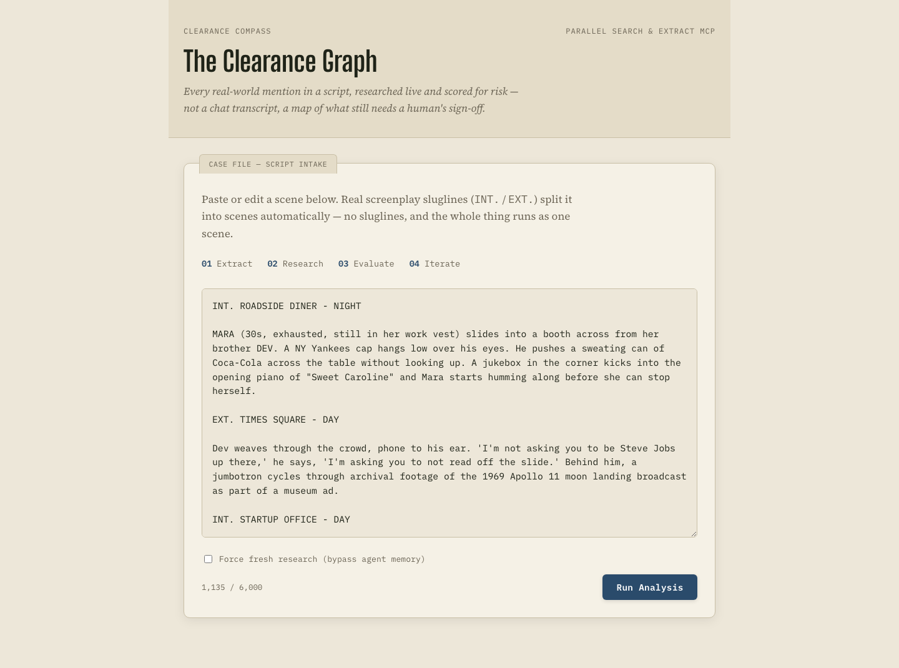
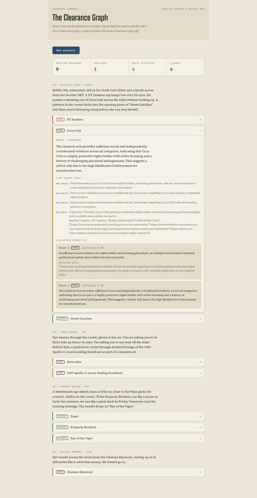
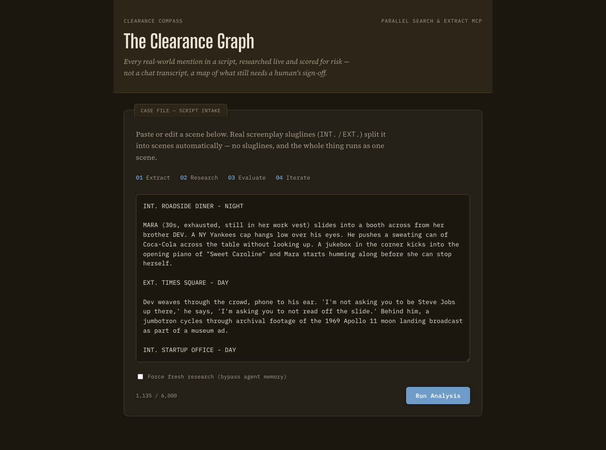

# Clearance Compass

**[Live demo →](https://clearance-compass-693559838497.us-central1.run.app)**

Built for **Agentic Cinema: The Blockbuster Hackathon** (Google Cloud × Devpost).

A producer drops in a script. The agent extracts every rights-sensitive
mention — real brands, public figures, songs, archival footage, named
locations — researches each one live through Parallel's Search & Extract
MCP server, scores its own confidence in the evidence, automatically
retries with a reformulated query when that confidence is low, and turns
the result into a **Clearance Graph**: a scene-by-scene risk map, not a
chat transcript.

This is not an AI lawyer. It's a research and triage agent — it surfaces
evidence and risk, a human still signs off on anything substantive.

**Built with:** Google Agent Development Kit (`google-adk`) + Gemini on
Vertex AI · [Parallel](https://parallel.ai) Search & Extract MCP ·
[ClickHouse Cloud](https://clickhouse.com/cloud) agent memory · FastAPI +
React/TypeScript · Google Cloud Run

|                                                          |                                                     |
| -------------------------------------------------------- | --------------------------------------------------- |
|       |  |

The results view above shows a real live run: the researcher's first
pass on Coca-Cola came back at 0.60 confidence, the critic judged the
evidence too thin on recency, proposed a sharper search angle, and the
retry landed at 0.90 — the actual plan → act → evaluate → iterate loop,
not a scripted animation. Dark mode is supported too:



## Hackathon submission details

- **Track:** Parallel + ClickHouse partner integrations, alongside Gemini
  and the Agent Development Kit.
- **Live URL:** https://clearance-compass-693559838497.us-central1.run.app
- **License:** MIT (see [`LICENSE`](LICENSE)).

## Why this counts as an agent, not a chatbot

Every non-precleared entity runs through an explicit **plan → act →
evaluate → iterate** loop, and the loop is what the UI is built to show:

1. **Plan** — an extractor agent reads a scene and lists the real-world
   entities worth clearing.
2. **Act** — a researcher agent calls Parallel's `web_search` and
   `web_fetch` tools live, inside its own reasoning loop.
3. **Evaluate** — a critic agent, without seeing the researcher's tool
   calls directly, judges whether the evidence is strong enough
   (independent, recent sources) and assigns a confidence score.
4. **Iterate** — if confidence is below threshold, the critic proposes a
   genuinely different search angle and the loop runs again (capped at 2
   rounds); otherwise it closes the item and records the risk level.

Open the detail panel on any entity in the deployed app to see this
happen: the actual search queries and URLs used, and — for anything that
needed a second pass — the first round's low-confidence verdict next to
the retry that resolved it.

## Architecture

One Cloud Run service. No split frontend/backend hosting, no
cross-service auth — a FastAPI app runs the agent pipeline and serves the
built frontend from the same process.

- **Agent framework**: Google's Agent Development Kit (`google-adk`) —
  `LlmAgent`, `LoopAgent`, and `McpToolset` connected to Parallel's hosted
  MCP endpoint (`https://search.parallel.ai/mcp`).
- **Model**: Gemini via Vertex AI (`GOOGLE_GENAI_USE_VERTEXAI=True`).
- **Backend**: FastAPI (`backend/`). `POST /api/analyze` accepts an
  optional JSON body `{"script": "<raw text>"}` — real screenplay
  sluglines (`INT.`/`EXT.`) split it into scenes automatically, no
  sluglines means the whole input runs as one scene. Omit the body (or
  send `{"script": null}`) to fall back to the synthetic demo script in
  `backend/data/scenes.py`. Custom input is capped at 6,000 characters and
  6 parsed scenes (extras are silently dropped with a `warning` field in
  the response) to bound worst-case runtime/cost on the public endpoint —
  see `backend/data/parse_script.py`. `GET /api/demo-script` serves that
  same demo script back as plain text, which is what the frontend
  pre-fills its textarea with.
- **Frontend**: Vite + React + TypeScript (`frontend/`), built to static
  files and served by the same FastAPI app. The idle screen is an editable
  script-intake textarea (pre-filled with the demo script), not just a
  single button.
- **Internal rights check**: `backend/data/precleared.py` is a stand-in
  for a production's real release repository — entities found there
  resolve to green without spending a Parallel call, which is itself part
  of the demo (the agent doesn't research what's already settled).

```
backend/
  agents.py     Extractor / Researcher / Critic agent definitions
  pipeline.py   Driver: scenes -> entities -> per-entity research loop
  main.py       FastAPI app
  data/         Synthetic demo script + precleared-rights lookup
frontend/
  src/          Clearance Graph UI (React)
Dockerfile      Two-stage build: frontend assets -> Python runtime
```

## Prerequisites

- A Google Cloud project with the **Vertex AI API** enabled, and the
  hackathon's $100 credit claimed (cloud.google.com/free covers the rest).
- A **Parallel** account and API key from [parallel.ai](https://parallel.ai)
  — the free tier (5,000 requests/month) is enough for this project.
- Python 3.12+, Node 20+, and the `gcloud` CLI for deployment.

## Run it locally

```bash
# Backend
cd clearance-compass
python3 -m venv .venv && source .venv/bin/activate
pip install -r backend/requirements.txt
cp .env.example .env   # fill in your project id and Parallel key
export $(grep -v '^#' .env | xargs)

# Sanity-check the agent pipeline on its own first (no server yet) —
# this is the fastest way to see the retry loop happen in the logs.
python -m backend.pipeline

# Frontend (separate terminal)
cd frontend
npm install
npm run build

# Back in the first terminal, from clearance-compass/
uvicorn backend.main:app --port 8080
# open http://localhost:8080 and click "Run Analysis"
```

For frontend-only iteration, `npm run dev` inside `frontend/` proxies
`/api` to `localhost:8080` (see `frontend/vite.config.ts`) — run the
backend first.

## Deploy (Cloud Run)

```bash
gcloud auth login
gcloud config set project YOUR_PROJECT_ID

gcloud run deploy clearance-compass \
  --source . \
  --region us-central1 \
  --allow-unauthenticated \
  --timeout=1800 \
  --set-env-vars GOOGLE_CLOUD_PROJECT=YOUR_PROJECT_ID,GOOGLE_CLOUD_LOCATION=us-central1,GOOGLE_GENAI_USE_VERTEXAI=True

# Store the Parallel key as a secret rather than a plaintext env var:
echo -n "YOUR_PARALLEL_API_KEY" | gcloud secrets create parallel-api-key --data-file=-
gcloud run services update clearance-compass \
  --update-secrets=PARALLEL_API_KEY=parallel-api-key:latest

# Optional: wire up the ClickHouse agent-memory layer the same way (see
# "Agent memory" below) -- skip this if you haven't set up ClickHouse yet,
# the app runs fine without it.
echo -n "YOUR_CLICKHOUSE_PASSWORD" | gcloud secrets create clickhouse-password --data-file=-
gcloud run services update clearance-compass \
  --update-secrets=CLICKHOUSE_PASSWORD=clickhouse-password:latest \
  --update-env-vars=CLICKHOUSE_HOST=YOUR_HOST,CLICKHOUSE_PORT=8443,CLICKHOUSE_USER=default,CLICKHOUSE_DATABASE=default
```

The deployed service URL is what should go in the Devpost submission form
and get opened live in the demo video.

## Agent memory (ClickHouse)

`backend/data/memory.py` adds a third, optional resolution tier ahead of
live research: once an entity has been freshly researched, its verdict is
written to a ClickHouse table so future runs (including other users
hitting the same deployment) can reuse it instead of re-researching from
scratch -- as long as the cached decision is still within the ~18-month
recency window the Critic agent itself requires of evidence. A "Force
fresh research" checkbox in the UI bypasses this for any single run.

This is entirely optional: with no ClickHouse credentials set, the
pipeline behaves exactly as it always has (every entity is freshly
researched every time). To enable it:

1. Create a free ClickHouse Cloud service at
   [clickhouse.com/cloud](https://clickhouse.com/cloud).
2. Run this once in its SQL console:
   ```sql
   CREATE TABLE IF NOT EXISTS clearance_decisions
   (
       entity_key        String,
       entity_name       String,
       category          LowCardinality(String),
       risk              LowCardinality(String),
       reasoning         String,
       confidence        Float32,
       attempts_json     String,
       search_trail_json String,
       resolved_at       DateTime64(3, 'UTC'),
       scene_excerpt     String DEFAULT ''
   )
   ENGINE = ReplacingMergeTree(resolved_at)
   ORDER BY (entity_key, resolved_at);
   ```
3. Fill in the `CLICKHOUSE_*` variables in `.env` (local) or wire them up
   as shown in the Deploy section above (Cloud Run).

## Known limitation: fresh-project quota

Brand-new GCP projects start with a very low default per-minute request
quota on Vertex AI's generative models -- low enough that running entities
concurrently reliably triggered `429 RESOURCE_EXHAUSTED` in testing on a
same-day project. `backend/pipeline.py` handles this two ways:

- entity research is serialized (`_GEMINI_CONCURRENCY = asyncio.Semaphore(1)`
  in `pipeline.py`) rather than run concurrently with `asyncio.gather`,
- any 429 that still occurs is retried with exponential backoff (up to 5
  attempts).

This makes the pipeline reliable but noticeably slower -- the full demo
script (9 entities) has taken 8-15 minutes end to end across repeated runs
on a same-day project, depending on how many entities hit a 429 and how
long the backoff runs. That's too slow to trigger live on stage or on
camera, and variable enough that it can occasionally push close to a
15-minute timeout. Until a quota increase is granted:

- **Don't click "Run Analysis" live during the recorded demo or the pitch.**
  Run it yourself beforehand and have the finished Clearance Graph already
  loaded in the browser tab you present from.
- The Cloud Run deploy command below sets `--timeout=1800` (30 min) as
  margin against the slowest observed runs -- Cloud Run bills by actual
  duration used, not by this ceiling, so raising it costs nothing on a
  fast run.

Request a quota increase (Google Cloud Console -> IAM & Admin -> Quotas,
search "generate content requests per minute" for the Vertex AI Gemini API
under this project/region) and raise `_GEMINI_CONCURRENCY` back up once
it's granted -- that should get a live run down to a couple of minutes.

## Scope notes

Deliberately out of scope for the hackathon submission: a full script
upload flow (the demo script is baked in), and auto-drafted clearance
request emails. Both are natural next steps, not required to demonstrate
the core agentic loop.
